# AAI Super Brain: Folder Interconnectedness Analysis
Generated: 2025-07-15T11:25:00Z

## 📊 Current State Summary

### Folder Maturity Assessment
```
integrations/  ████████████████████████████████████████████████████████████████████████████████████████████████ 95% (SuperClaude complete)
PRPs/         ████████████████████████████████████████████████████████████████████████████████████████████████ 85% (High quality, limited quantity)
projects/     ████████████████████████████████████████████████████████████████████████████████████████████████ 15% (Minimal test project only)
templates/    ████████████████████████████████████████████████████████████████████████████████████████████████ 10% (Single basic template)
```

### 🔍 Key Findings

#### **Integrations/ (95% Complete)**
- **Strength**: SuperClaude fully integrated with 19 commands, 9 personas
- **Gap**: Only 1 integration type, no custom AAI integrations
- **Function**: Bridge between external frameworks and AAI intelligence

#### **PRPs/ (85% Complete)**
- **Strength**: High-quality implementation blueprints with validation
- **Gap**: Limited quantity (2 PRPs), no automation or organization
- **Function**: Comprehensive project specifications with context

#### **Projects/ (15% Complete)**
- **Strength**: Basic testing framework exists
- **Gap**: Severely underdeveloped, no active projects or management
- **Function**: Project lifecycle and implementation workspace

#### **Templates/ (10% Complete)**
- **Strength**: Basic structure for feature requests
- **Gap**: Extremely limited, only 1 template for entire system
- **Function**: Reusable patterns for common workflows

## 🔗 Interconnectedness Gap Analysis

### Current Connections (Weak)

```mermaid
graph TB
    Brain[🧠 Brain Intelligence] --> SuperClaude[SuperClaude Integration]
    Brain --> PRPs[PRP System]
    Templates[Templates] --> PRPs
    Projects[Projects] --> Brain
    
    style Brain fill:#51cf66
    style SuperClaude fill:#228be6
    style PRPs fill:#fab005
    style Projects fill:#fd7e14
    style Templates fill:#e03131
```


### Missing Critical Connections
- ❌ **Templates → Projects**: No auto-scaffolding
- ❌ **PRPs → Projects**: No automated project creation
- ❌ **Integrations → PRPs**: No integration-aware PRPs
- ❌ **Projects → Templates**: No template generation from successes
- ❌ **Cross-folder intelligence**: No unified learning system

## 🚀 Super Brain Innovation Opportunities

### 1. **Unified Intelligence Layer**
Create central intelligence that spans all folders:

**Intelligence Modules to Add:**
- `brain/modules/folder-orchestrator.md` - Cross-folder workflow management
- `brain/modules/pattern-miner.md` - Extract patterns across all folders
- `brain/modules/project-intelligence.md` - AI-powered project assistance
- `brain/modules/integration-recommender.md` - Suggest integrations based on context

**Capabilities:**
- Learn from successful PRPs to improve templates
- Predict project needs based on PRP patterns
- Recommend integrations based on project context
- Auto-generate templates from successful projects

### 2. **Automated Workflow Orchestration**

**Complete Pipeline:**
```
Feature Request → Template → Enhanced Template → PRP → Project → Integration → Success Pattern
```

**Automation Points:**
- **Template Enhancement**: AI improves templates based on usage patterns
- **PRP Generation**: Auto-create PRPs from feature requests
- **Project Scaffolding**: Auto-generate project structure from PRPs
- **Integration Selection**: Smart integration recommendations
- **Success Mining**: Extract patterns from completed projects

### 3. **Advanced Cross-Folder Analytics**

**Metrics to Track:**
- Template usage → PRP success correlation
- PRP complexity → Project completion rates
- Integration choice → Project success patterns
- Cross-folder workflow efficiency

**Intelligence Features:**
- Predictive modeling for project outcomes
- Pattern recognition across folder boundaries
- Automated optimization suggestions
- Knowledge graph connections

### 4. **Enhanced Interconnection System**

**Symlink Network:**
```
templates/
├── from-successful-prps/        → PRPs/successful-patterns/
├── from-completed-projects/     → projects/completed/templates/
└── integration-templates/       → integrations/templates/

PRPs/
├── auto-generated/              → templates/enhanced/
├── integration-aware/           → integrations/prp-templates/
└── project-ready/              → projects/scaffolding/

projects/
├── from-prps/                  → PRPs/ready-for-implementation/
├── integration-configs/        → integrations/project-configs/
└── success-patterns/           → templates/from-projects/

integrations/
├── project-specific/           → projects/active/integrations/
├── prp-templates/             → PRPs/integration-templates/
└── success-patterns/          → templates/integration-patterns/
```

## 🎯 Specific Enhancement Recommendations

### **Templates/ Enhancement (Priority: Critical)**
1. **Template Intelligence System**
   - AI-powered template generation from successful patterns
   - Dynamic templates that adapt based on context
   - Template performance metrics and optimization

2. **Comprehensive Template Library**
   - Project scaffolding templates
   - Integration setup templates
   - PRP generation templates
   - Testing framework templates

3. **Template-to-PRP Pipeline**
   - Auto-enhance templates based on PRP requirements
   - Generate PRP drafts from template inputs
   - Validation loops for template effectiveness

### **Projects/ Enhancement (Priority: Critical)**
1. **Project Lifecycle Management**
   - Full project creation, tracking, completion workflow
   - AI-powered project assistance throughout lifecycle
   - Success metrics and optimization analytics

2. **PRP-to-Project Pipeline**
   - Auto-generate project structure from PRPs
   - Inherit requirements and validation from PRPs
   - Track PRP-to-project success correlation

3. **Project Intelligence Features**
   - Real-time AI assistance during development
   - Predictive issue detection and resolution
   - Automated testing and validation

### **PRPs/ Enhancement (Priority: High)**
1. **PRP Automation System**
   - AI-powered PRP generation from feature requests
   - Smart categorization and organization
   - Success pattern mining and optimization

2. **Integration-Aware PRPs**
   - PRPs that include integration recommendations
   - Integration-specific PRP templates
   - Cross-integration compatibility analysis

3. **PRP Analytics Dashboard**
   - Success rate tracking and optimization
   - Pattern recognition across PRPs
   - Predictive modeling for PRP success

### **Integrations/ Enhancement (Priority: Medium)**
1. **Multi-Framework Support**
   - Add support for additional AI frameworks
   - Create AAI-native custom integrations
   - Dynamic integration loading based on context

2. **Integration Intelligence**
   - Smart integration recommendations
   - Integration performance analytics
   - Auto-optimization based on usage patterns

3. **Cross-Folder Integration Hooks**
   - Integration-aware project scaffolding
   - Integration-specific PRP templates
   - Integration success pattern mining

## 🔧 Implementation Roadmap

### Phase 1: Foundation (Weeks 1-2)
- Create unified intelligence modules
- Implement basic cross-folder symlinks
- Build template library from existing patterns

### Phase 2: Automation (Weeks 3-4)
- Implement template-to-PRP pipeline
- Build PRP-to-project scaffolding
- Add integration recommendations

### Phase 3: Intelligence (Weeks 5-6)
- Deploy AI-powered assistance across folders
- Implement predictive analytics
- Add success pattern mining

### Phase 4: Optimization (Weeks 7-8)
- Fine-tune cross-folder workflows
- Optimize based on usage patterns
- Add advanced analytics and reporting

## 🎉 Expected Outcomes

### **Productivity Gains**
- 5x faster project setup through automation
- 80% reduction in template creation time
- 60% improvement in PRP quality through AI assistance

### **Quality Improvements**
- Higher project success rates through predictive modeling
- Better integration choices through intelligent recommendations
- Consistent patterns across all development phases

### **Intelligence Evolution**
- System learns from every project and PRP
- Continuous improvement through pattern recognition
- Emergent capabilities from cross-folder connections

---
*Roadmap for transforming AAI into a truly interconnected "super brain" system*