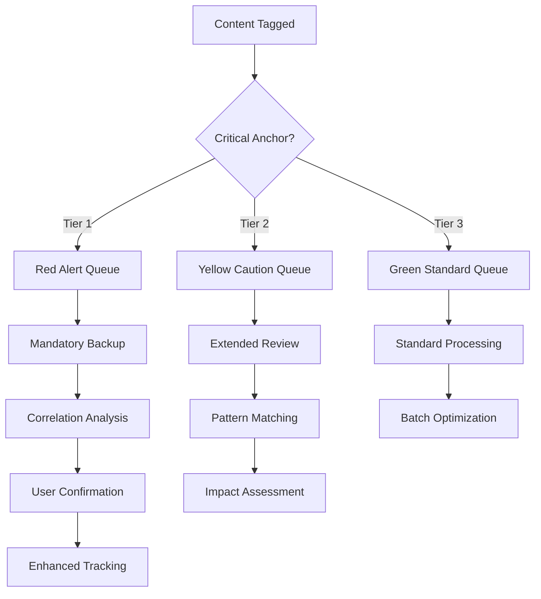

# Critical Tag Anchors (Phase 3)

## 🚨 Priority Routing for High-Importance Decisions

### Critical Tag Classification
```yaml
critical_anchors:
  tier_1_critical:
    - "#architecture"     # System design decisions
    - "#security"         # Security implications
    - "#data-safety"      # Data loss prevention
    - "#integration"      # External system connections
    
  tier_2_important:
    - "#performance"      # System efficiency impacts
    - "#compatibility"    # Backward compatibility issues
    - "#workflow"         # Process optimization
    - "#intelligence"     # AI capability changes
    
  tier_3_monitored:
    - "#research"         # Documentation gathering
    - "#decision"         # General decision tracking
    - "#insight"          # Discovery logging
    - "#context"          # Project context updates
```

### Priority Routing Rules
#### Tier 1 Critical (Red Alert)
- **Auto-escalation**: Immediate attention required
- **Documentation**: Must update explain.md with detailed rationale
- **Backup Protocol**: Auto-backup before any changes
- **Correlation Check**: Mandatory correlation mapping analysis
- **User Confirmation**: Explicit approval for implementation
- **Success Tracking**: Enhanced metrics collection

#### Tier 2 Important (Yellow Caution)  
- **Enhanced Review**: Extended analysis phase
- **Pattern Matching**: Check against historical similar decisions
- **Impact Assessment**: Analyze downstream effects
- **Testing Requirements**: Validation before deployment
- **Progress Monitoring**: Regular status updates

#### Tier 3 Monitored (Green Standard)
- **Standard Processing**: Normal workflow handling
- **Batch Optimization**: Can be processed in groups
- **Learning Integration**: Feed into pattern recognition
- **Periodic Review**: Weekly/monthly batch analysis

### Auto-Routing Logic
```python
def route_by_criticality(tags: List[str], content: str) -> str:
    """Route content based on critical tag analysis."""
    
    # Check for tier 1 critical tags
    tier_1_tags = {"#architecture", "#security", "#data-safety", "#integration"}
    if any(tag in tier_1_tags for tag in tags):
        return "critical_priority_queue"
    
    # Check for tier 2 important tags  
    tier_2_tags = {"#performance", "#compatibility", "#workflow", "#intelligence"}
    if any(tag in tier_2_tags for tag in tags):
        return "important_review_queue"
    
    # Default to standard processing
    return "standard_workflow_queue"
```

### Special Handling Protocols
#### Architecture Decisions (#architecture)
- **Mandatory Requirements**:
  - Document in explain.md with "Critical" impact level
  - Update workflow-edges.md correlation mapping
  - Create decision trace in decision-trace.mmd
  - Auto-backup brain/Claude.md before changes
  - Test compatibility with existing systems

#### Security Implications (#security)
- **Enhanced Protocols**:
  - Security impact assessment required
  - Review for credential/secret exposure
  - Validate against security best practices
  - Document threat model implications
  - Require explicit user security approval

#### Data Safety (#data-safety)
- **Protection Measures**:
  - Archive-first approach mandatory
  - Verify backup integrity before proceeding
  - Test rollback procedures
  - Document recovery processes
  - Monitor for data loss indicators

#### Integration Changes (#integration)
- **Validation Requirements**:
  - API compatibility testing
  - Dependency impact analysis
  - Service availability verification
  - Fallback mechanism implementation
  - Integration test execution

### Escalation Pathways


### Performance Monitoring
#### Critical Decision Metrics
- **Response Time**: Tier 1 decisions must complete within 24 hours
- **Accuracy Rate**: >95% success rate for critical decisions
- **Reversal Prevention**: Zero reversals for security/data-safety decisions
- **User Satisfaction**: >4.5/5 for critical decision handling

#### Auto-Adjustment Rules
- **False Positive Rate >10%**: Reduce tag sensitivity
- **Miss Rate >5%**: Increase pattern detection
- **User Override >20%**: Recalibrate criticality levels

### Alert System Integration
#### Real-time Notifications
- **Tier 1 Critical**: Immediate alert with decision summary
- **Tier 2 Important**: Daily digest with grouped decisions
- **Pattern Violations**: Alert when critical decisions bypass protocols

#### Dashboard Integration
- **Status Indicators**: Red/Yellow/Green criticality meters
- **Queue Monitoring**: Active critical decisions tracking
- **Trend Analysis**: Critical decision frequency and outcomes

---
*Priority intelligence for mission-critical decision handling*