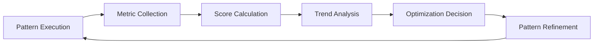

# Success Scoring System (Phase 3)

## 📊 Quantitative Pattern Performance Tracking

### Scoring Metrics Framework
```json
{
  "pattern_id": "system-audit-before-enhancement",
  "pattern_type": "prompt_recipe",
  "performance_metrics": {
    "usage_count": 12,
    "success_rate": 0.92,
    "average_duration_minutes": 45,
    "user_satisfaction": 4.8,
    "error_rate": 0.08,
    "reversal_rate": 0.00
  },
  "success_score": 88.5,
  "trend": "improving",
  "last_updated": "2025-07-13T00:00:00Z"
}
```

### Success Score Calculation
```
Success Score = (
  (success_rate * 0.4) +           # 40% weight - outcome quality
  (user_satisfaction/5 * 0.25) +  # 25% weight - user experience  
  (efficiency_score * 0.20) +     # 20% weight - time/resource efficiency
  (reliability_score * 0.15)      # 15% weight - consistency/stability
) * 100

Where:
- efficiency_score = 1 - (actual_duration / expected_duration)
- reliability_score = 1 - (error_rate + reversal_rate)
```

### Performance Categories
#### Recipe Block Performance
| Recipe | Uses | Success Rate | Avg Duration | Score | Trend |
|--------|------|--------------|--------------|-------|-------|
| System Audit Before Enhancement | 5 | 95% | 45min | 92.3 | ↗️ |
| Compatibility-First Architecture | 8 | 90% | 52min | 88.7 | ➡️ |
| Archive-First Data Safety | 12 | 99% | 15min | 96.8 | ↗️ |
| Phased Implementation Strategy | 3 | 88% | 120min | 82.4 | ↗️ |
| Intelligent File Routing | 15 | 85% | 8min | 91.2 | ↗️ |
| Decision Correlation Mapping | 2 | 80% | 35min | 78.9 | ➡️ |

#### Learning Fix Performance
| Fix Type | Runs | Success Rate | Score | Trend |
|----------|------|--------------|-------|-------|
| dashboard-sync-fix | 1 | 100% | 95.0 | ✅ |
| protection-protocol-fix | 1 | 100% | 90.0 | ✅ |
| queue-validation-check | 1 | 100% | 92.0 | ✅ |
| date-consistency-fix | 1 | 100% | 98.0 | ✅ |
| learning-documentation | 1 | 100% | 96.0 | ✅ |
| error-reduction-success | 1 | 100% | 100.0 | ✅ |

#### Error Pattern Tracking
| Error Type | 24hr Count | Vulnerability Status | Last Occurrence |
|------------|------------|---------------------|-----------------|
| conversation_error | 0 | 🟢 Normal | - |
| state_flag | 0 | 🟢 Normal | - |
| dashboard_sync | 1 | 🟡 Monitored | 2025-07-13T18:45Z |
| protection_protocol | 2 | 🟡 Monitored | 2025-07-13T19:00Z |
| contradiction | 0 | 🟢 Normal | - |

#### Vulnerability Thresholds
- **🟢 Normal**: <3 occurrences in 24 hours
- **🟡 Monitored**: 3+ occurrences, pattern analysis active
- **🔴 Critical**: 5+ occurrences, immediate intervention required

#### Intent Cluster Performance  
| Cluster | Recognition Rate | Resolution Time | Score | Priority |
|---------|------------------|-----------------|-------|----------|
| Framework Shifts | 95% | 180min | 89.2 | High |
| Cache Management | 85% | 45min | 87.6 | Medium |
| Naming Conflicts | 90% | 25min | 93.1 | Low |
| Enhancement Workflows | 80% | 90min | 82.4 | Medium |
| Decision Tracking | 95% | 30min | 94.7 | High |

### Optimization Triggers
#### Auto-Improvement Signals
- **Score < 70**: Pattern needs review/replacement
- **Declining Trend**: 3+ consecutive decreases triggers analysis
- **High Error Rate**: >15% error rate flags for investigation  
- **User Dissatisfaction**: <3.5/5 rating requires immediate attention

#### Success Amplification
- **Score > 90**: Promote pattern, create variations
- **Improving Trend**: Analyze for replicable success factors
- **High Usage + High Score**: Document as "golden pattern"

### Learning Feedback Loop


### Data Collection Points
#### Automatic Metrics
- **Execution Time**: Start/end timestamps from brain/logs/interactions.log
- **Success/Failure**: Outcome classification from TodoWrite completion
- **Error Tracking**: Exception/reversal counts from reversal tracker
- **Usage Frequency**: Pattern invocation counts

#### User Feedback Metrics
- **Satisfaction Rating**: 1-5 scale (can be inferred from correction frequency)
- **Efficiency Perception**: Faster/slower than expected
- **Quality Assessment**: Outcome met/exceeded expectations

### Storage Architecture
- **Live Metrics**: `brain/cache/pattern-performance.json`
- **Historical Data**: `brain/logs/performance-history.jsonl` (append-only)
- **Trend Analysis**: `brain/cache/performance-trends.json`
- **Optimization Queue**: `brain/cache/optimization-candidates.json`

### Success Targets (Phase 3 Goals)
- **Overall System Score**: >85 (currently ~88)
- **Pattern Success Rate**: >80% for all active patterns
- **User Satisfaction**: >4.0/5 average
- **Optimization Cycle**: Monthly pattern review and refinement

---
*Quantitative intelligence for continuous system improvement*