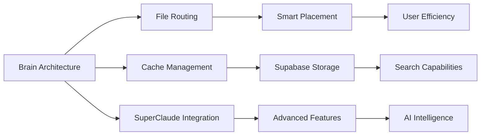

# Decision Correlation Mapping (Phase 2)

## 🕸️ Systemic Decision Relationships

### Correlation Network Structure
```yaml
# Decision correlation network mapping
correlation_map:
  architecture_decisions:
    brain_centric_design:
      correlates_with:
        - file_routing_rules: 0.95  # High correlation
        - cache_management: 0.87
        - superclaude_integration: 0.82
      impacts:
        - workflow_intelligence: "enables advanced features"
        - system_modularity: "creates clear separation"
        - future_scalability: "supports growth"
      
    archive_strategy:
      correlates_with:
        - data_safety_protocols: 0.93
        - reference_preservation: 0.88
        - cleanup_operations: 0.85
      impacts:
        - knowledge_retention: "prevents information loss"
        - system_cleanliness: "reduces clutter"
        - historical_context: "maintains project memory"

  infrastructure_decisions:
    supabase_over_mysql:
      correlates_with:
        - api_integration_strategy: 0.91
        - search_capabilities: 0.89
        - scalability_requirements: 0.84
      impacts:
        - full_text_search: "enables semantic search"
        - maintenance_overhead: "reduces local complexity"
        - feature_velocity: "accelerates development"

    openrouter_integration:
      correlates_with:
        - embeddings_strategy: 0.96
        - ai_intelligence_features: 0.94
        - cost_optimization: 0.78
      impacts:
        - semantic_understanding: "enables intent similarity"
        - operational_costs: "predictable API pricing"
        - feature_sophistication: "unlocks advanced AI"

  workflow_decisions:
    log_command_intelligence:
      correlates_with:
        - auto_tagging_system: 0.92
        - content_routing: 0.89
        - contradiction_detection: 0.86
      impacts:
        - system_learning: "improves over time"
        - user_efficiency: "reduces manual categorization"
        - data_quality: "prevents inconsistencies"

    phase_implementation_strategy:
      correlates_with:
        - risk_management: 0.94
        - user_feedback_integration: 0.87
        - system_stability: 0.91
      impacts:
        - rollback_capability: "enables safe testing"
        - incremental_value: "delivers benefits early"
        - complexity_management: "prevents overwhelm"
```

### Decision Impact Chains


### Correlation Strength Indicators
- **0.95-1.0**: Critical dependency (change one, must review other)
- **0.85-0.94**: Strong correlation (likely needs coordination)
- **0.70-0.84**: Moderate correlation (consider impact)
- **0.50-0.69**: Weak correlation (monitor for unexpected effects)
- **<0.50**: Minimal correlation (independent decisions)

### Systemic Decision Patterns
#### High-Impact Clusters
1. **Architecture + Infrastructure**: Brain design drives storage/API choices
2. **Workflow + Intelligence**: Smart features enable better user experience
3. **Safety + Organization**: Archive strategy supports cleanup operations

#### Risk Correlation Zones
- **Single Point of Failure**: OpenRouter dependency affects multiple features
- **Cascade Triggers**: File routing changes could impact entire brain system
- **Integration Risks**: SuperClaude bridge affects both archiving and intelligence

### Learning from Correlations
#### Successful Patterns
- **Compatibility-First**: Decisions that preserve existing functionality succeed
- **Modular Integration**: Bridge/adapter patterns reduce correlation complexity
- **Phased Rollout**: Staged implementation reduces systemic risk

#### Warning Signals
- **High Correlation Count**: Decisions affecting >5 other areas need extra care
- **Circular Dependencies**: When A→B→C→A creates fragile systems
- **Orphaned Decisions**: Decisions with <2 correlations may be unnecessary

---
*Systems thinking approach to decision architecture*