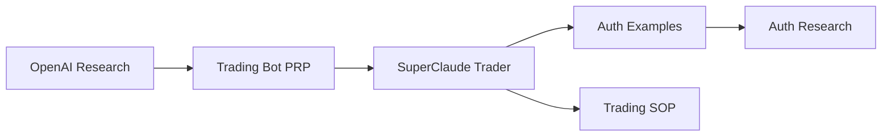

# Knowledge Graph - Cross-Folder Relationships

## Purpose
Map semantic relationships between research, PRPs, projects, examples, and documentation to enable intelligent cross-referencing.

## Graph Structure

### Nodes
- **Research**: Topics, technologies, APIs
- **PRPs**: Project requirement proposals  
- **Projects**: Active implementations
- **Examples**: Code patterns and templates
- **Documentation**: SOPs, guides, references

### Edges
- **REFERENCES**: Research → PRP (PRP cites research)
- **IMPLEMENTS**: PRP → Project (Project implements PRP)
- **USES**: Project → Research (Project uses research knowledge)
- **GENERATES**: Project → Examples (Project creates reusable examples)
- **DOCUMENTS**: Project → Documentation (Project creates SOPs)
- **PATTERNS**: Examples → Research (Examples validate research patterns)

## Current Graph

### Initial State
*No relationships mapped yet - graph will build as research and projects are created.*

## Relationship Examples

## Auto-Detection Rules
- New research creates research node
- PRP creation scans for research references
- Project completion maps to PRPs and examples
- Cross-project patterns create research promotions

---
*Intelligent relationship mapping for context-aware development*